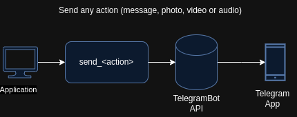

  

# python-telegrambot
This module provides an interface for `TelegramBot API` (https://core.telegram.org/bots/api)

## Telegram Bot
Bots are small applications that use messages for a interface based into following
a common pattern:

`https://api.telegram.org/bot<token>/METHOD_NAME`

where:

* Token: a unique ID given at the moment of the Bot creation
* METHOD_NAME: According with the desired action to applly, we need to call to
the correspond method.

## Actions
In this project, we support the following actions:
1. Send and receive messages
2. Send and receive pictures
3. Send and receive audios
4. Send and receive videos

Being the architecture diagram of sending actions:

  

and for receiving actions:

  

